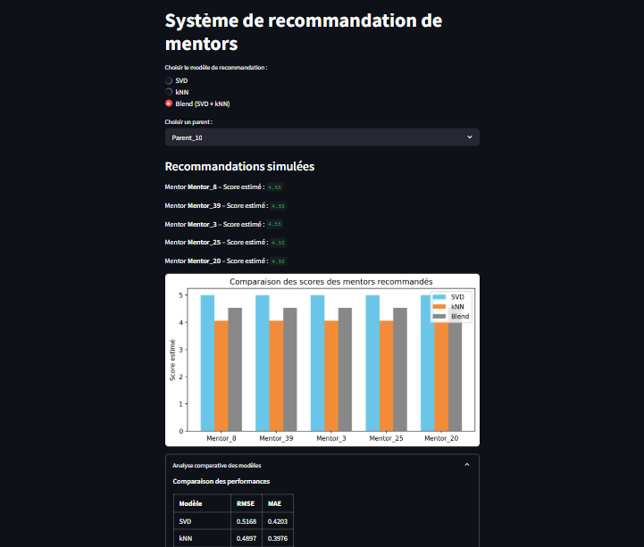

# eudsphere_matching
Un système de recommandation de mentors (professeur/étudiant) à des parents selon les besoins de leurs enfants

## Présentation  
Ce projet vise à faciliter le processus de mise en relation entre parents et mentors en proposant automatiquement les mentors les plus adaptés aux besoins de chaque famille, sur la base d'un historique de préférences et d'interactions.

## Méthodes utilisées  
Deux approches de filtrage collaboratif ont été implémentées :  
- **SVD (Singular Value Decomposition)** : un modèle basé sur la factorisation de matrice.  
- **kNN item-based** : un modèle basé sur la similarité entre les mentors.  
- **Blend des deux modèles** : une moyenne pondérée des scores SVD et kNN pour obtenir de meilleures performances.

## Résultats  
Une analyse comparative des performances a été réalisée à l’aide des métriques RMSE et MAE.  
Le blend (mélange des deux modèles) permet de tirer parti des avantages des deux approches.

## Application interactive  
Une interface a été développée avec **Streamlit** pour tester le système en sélectionnant un parent et en affichant les mentors recommandés.

## Aperçu de l'application

Voici un aperçu de l'application Streamlit permettant de visualiser les recommandations personnalisées :



Lancement de l’app :  
```bash
python3 -m streamlit run app.py
